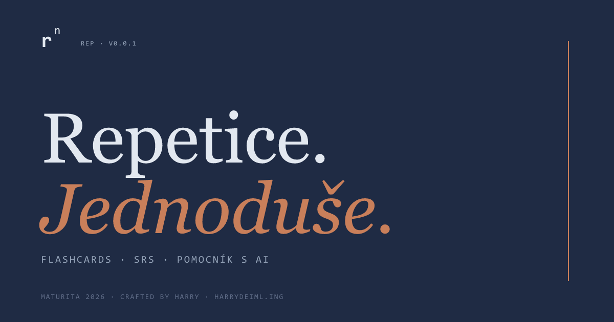

<div align="right">

[🇨🇿 česky](./README.md) · **🇬🇧 english**

</div>

# rep — flashcard trainer

> Flashcards · SRS · AI helper. For people who actually want to remember the material.



**Live:** [rep.harrydeiml.ing](https://rep.harrydeiml.ing) · **Stack:** Vite + React 19 + TypeScript + Tailwind v4 · **Hosting:** Cloudflare Pages + D1

A local-first PWA flashcard trainer. No account, no fees, data stays on
your device (unless you opt into cloud sync). Built while preparing for
the Czech high-school graduation exam (*maturita*) in 2026 and tuned
for that specific use case — Computer Science / Web Dev / Czech
Literature topics — but you can pour any content into it.

The UI is in Czech (that's the target audience), but the codebase and
this English README should be enough to find your way around.

## Features

- **5 card types** — Q/A, Cloze deletion, MCQ, free response, code
- **4 review modes** — SRS (Anki SM-2 scheduler), Cram, Sprint, Boss (mock exam across decks)
- **3 ways to add cards:**
  - File upload (`.md`, `.txt`, `.csv` / TSV — auto-detected)
  - Manual form
  - **AI helper** — turns a topic or notes into a prompt; you paste it
    into ChatGPT / Claude / Gemini and feed the output back. No AI runs
    inside the app
- **Statistics** — activity heatmap, mastery per deck, projection to
  your deadlines, calibration (how confident you are vs. how well you
  actually know it)
- **Deck sharing** — base64url in the URL hash, no server roundtrip,
  the data never touches a backend
- **Cloud sync (optional)** — Google OAuth + email allowlist, snapshot
  push/pull to Cloudflare D1. The app works fine locally without an
  allowlist entry. No auto-sync — explicit push / pull so you don't
  silently overwrite work across devices
- **PWA** — installable, offline-ready, mobile + desktop responsive
- **Light + dark theme**, palette of navy + slate + warm terracotta accent

## Stack

| Layer | What's there |
|---|---|
| Frontend | Vite 6, React 19, TypeScript 5.7, Tailwind v4 (with `@theme` tokens) |
| State | Zustand + persist middleware (localStorage, key `rep:v1`) |
| Routing | wouter (hash routing for `/share`) |
| PWA | vite-plugin-pwa (Workbox precache, manifest, icons) |
| Auth | `@react-oauth/google` + HMAC-signed session cookies (no session table) |
| Backend | Cloudflare Pages Functions (TypeScript) + D1 (SQLite) |
| OG banner | `@resvg/resvg-js` (SVG → PNG at build time, `npm run gen:og`) |
| Fonts | JetBrains Mono (chrome), Inter (body), Instrument Serif (display) |

## Repo layout

```
src/
  components/         Routes + UI (lazy-loaded via React.lazy)
    landing/          Public landing page
    dashboard/        Main hub after sign-in
    review/           Review screen (SRS / Cram / Sprint / Boss)
    add/              Upload / manual / AI tab
    stats/            Statistics + calibration
    settings/         Profile, cloud sync, deadlines, theme
    share/            /share#... receive (deck import from URL)
    tour/             Walkthrough overlay (SVG mask cutout)
  lib/                Store, SRS scheduler, sync, theme, ...
  types.ts            Shared types (Card, Deck, ReviewState, ...)
functions/
  api/auth/           google.ts, me.ts, signout.ts
  api/sync/           pull.ts, push.ts
  lib/auth.ts         HMAC session signing/verifying + allowlist
public/               _headers, _redirects, icons, og.png, robots.txt
scripts/generate-og.mjs   SVG → PNG converter for the share banner
schema.sql            D1 schema (users, user_state)
wrangler.toml         Cloudflare config (D1 binding)
```

## Local development

```sh
npm install
npm run dev          # vite dev server at http://localhost:5173
npm run typecheck    # strict TS check, no emit
npm run build        # production build into dist/
npm run preview      # local preview of the production build
npm run gen:og       # regenerate public/og.png from public/og.svg
```

Without `VITE_GOOGLE_CLIENT_ID` set, the app runs **fully locally** —
the cloud sync section in Settings shows "not configured" and nothing
else changes. For local-first use you don't need anything beyond
`npm install && npm run dev`.

## Deploy + cloud sync setup

The frontend auto-deploys to Cloudflare Pages on `git push`. For full
**cloud sync** (Google OAuth + D1), you need to manually:

1. Create the D1 database (`wrangler d1 create rep`)
2. Apply `schema.sql`
3. Bind the DB in the Pages dashboard
4. Create a Google OAuth client in Google Cloud Console
5. Set env vars: `VITE_GOOGLE_CLIENT_ID`, `GOOGLE_CLIENT_ID`,
   `AUTHORIZED_EMAILS`, `SESSION_SECRET`, `NODE_VERSION`

Step-by-step in [`DEPLOY.md`](./DEPLOY.md).

## Design decisions (why it looks like this)

- **CLI / editorial aesthetic** — no "web app" pill circus. Sharp
  corners, border-only buttons with color-flip hover, monospace for
  "data" labels and metrics, serif (Instrument Serif) for display
  headings
- **Palette** — cool slate family around brand navy `#1f2b44`, warm
  terracotta `#c97f5a` as the single warm accent (streaks, due cards,
  accent text). The target is "NotebookLM but cooler" — not paper, not
  SaaS
- **No gamification** beyond a streak — no XP, no badges, no levels.
  This is not Duolingo
- **No AI inside the app** — no model is called from the server or the
  client. The "AI helper" is a prompt generator — you copy/paste into
  your favorite chat. No API keys, no fees, no vendor lock-in
- **Local-first** — everything works without a backend. Cloud sync is
  a bonus layer for multi-device, not a dependency

## Status

Active development during exam prep, with the oral exam on 2026-05-25.
Version `0.0.1` means "works, used daily, but no stable API". The data
format may still shift; back up via the JSON export in Settings.

## Extending & open source

This is primarily a personal maturita project, but the code is
**open source under the [MIT license](./LICENSE)** — fork it, use it,
modify it. No copyleft strings, just keep the copyright header.

**If you want to build your own version** (for your school / exam /
different subject), fork and go. No need to ask. A few pointers on
where to start:

| What you want to change | Where to look |
|---|---|
| Card / deck data model | `src/types.ts` |
| Global state, persist key, migrations | `src/lib/store.ts` |
| SRS scheduler (intervals, ease factor) | `src/lib/srs.ts` |
| Add a new card type | `src/components/review/`, `src/components/add/` |
| Change palette / fonts | `src/index.css` (`@theme` tokens) |
| New review mode | `src/components/review/ReviewScreen.tsx` + `types.ts` `ReviewMode` |
| Backend / cloud sync logic | `functions/api/`, `schema.sql` |

**If you want to contribute back** (bugfix, new feature, translation
improvement): open an issue or a PR at
[github.com/JsemHarry7/rep](https://github.com/JsemHarry7/rep). For
larger changes please file an issue first so you don't sink time into
something that wouldn't be mergeable (e.g. anything that would break
the author's active maturita workflow).

For questions / ideas / cloud-sync access requests, email
[kontakt@harrydeiml.ing](mailto:kontakt@harrydeiml.ing).

## Credits

Crafted by [harry](https://harrydeiml.ing) ·
[kontakt@harrydeiml.ing](mailto:kontakt@harrydeiml.ing) ·
licensed under [MIT](./LICENSE)
